# IO模型
1. I/O就是计算机内存与外部设备之间拷贝数据的过程,CPU访问内存的速度远远高于外部设备,因此CPU是先把外部设备的数据读到内存(缓冲区)里,然后再进行处理
2. `BIO`:同步阻塞式IO;`NIO`:同步非阻塞式IO;`AIO`:异步非阻塞式IO
3. 五种主要的IO模型
   * 同步阻塞IO:用户线程发起 read 调用后就阻塞了,让出 CPU.内核等待网卡数据到来,把数据从网卡拷贝到内核空间,接着把数据拷贝到用户空间,再把用户线程叫醒
   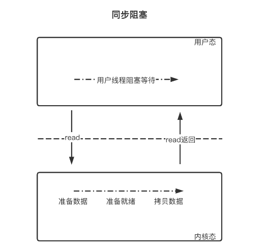 
   * 同步非阻塞IO:用户线程不断的发起 read 调用,数据没到内核空间时,每次都返回失败,直到数据到了内核空间,这一次 read 调用后,在等待数据从内核空间拷贝到用户空间这段时间里,线程还是阻塞的,等数据到了用户空间再把线程叫醒
   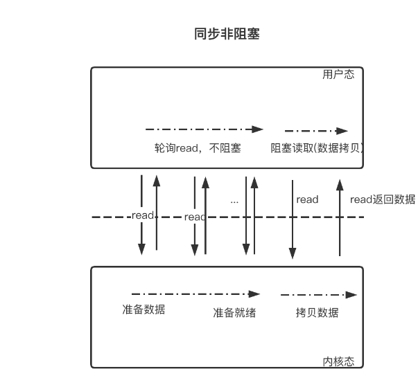
   * IO多路复用:
   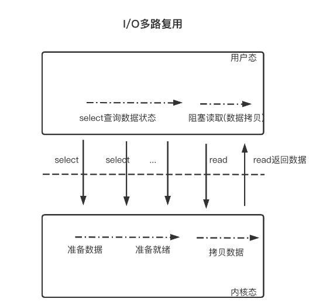 
   * 信号驱动IO:信号驱动IO不是用轮询的方式去监控数据就绪状态,而是在调用`sigaction`时候建立一个`SIGIO`的信号联系,当内核触发`SIGIO`信号应用程序直接执行处理函数.`SIGIO`信号的几种触发情况:
     - 文件描述符可读:当文件描述符处于非阻塞模式下,并且有数据可读时,会触发`SIGIO`信号.这意味着可以从该文件描述符中读取数据而不会被阻塞 
     - 文件描述符可写:如果文件描述符处于非阻塞模式下,并且可以进行写操作(例如输出到文件或者套接字),则会触发`SIGIO`信号
     - 异常条件:有些特殊的情况下,如套接字出现异常条件(例如带外数据到达),也会触发`SIGIO`信号
   * 异步IO:用户线程发起`read`调用的同时注册一个回调函数,`read`立即返回,等内核将数据准备好后,再调用指定的回调函数完成处理.在这个过程中,用户线程一直没有阻塞
   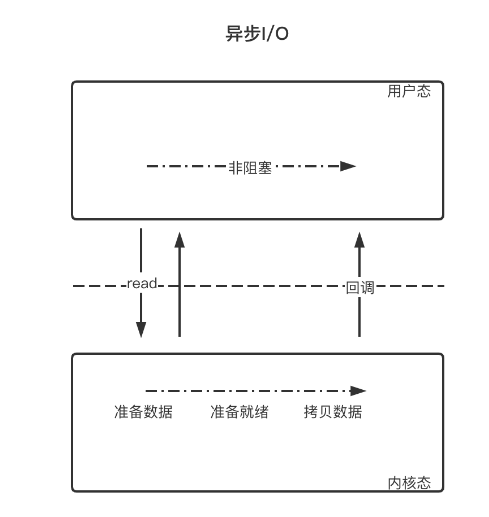 
   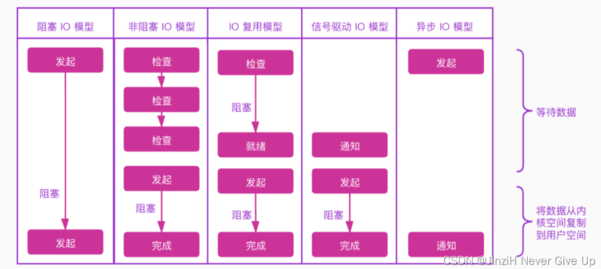
4. 信号驱动IO:
   ```C++
   #include <iostream>
   #include <csignal>
   #include <unistd.h>
   #include <fcntl.h>
   #include <cstring>
   // 定义信号处理函数
   void handle_signal(int signal) {//signal参数会传入触发了信号的信号类型,比如此时是传入SIGIO
      std::cout << "Received signal: " << signal << std::endl;
   }
   int main() {
      // 设置信号处理函数  SIGIO=异步I/O信号
      signal(SIGIO, handle_signal);//将SIGIO信号与handle_signal函数关联起来.当SIGIO信号触发时,系统会调用 handle_signal 函数
      // 打开一个文件
      int fd = open("example.txt", O_RDONLY);
      if (fd < 0) {
         std::cerr << "Error opening file!" << std::endl;
         return 1;
      }
      //设置文件描述所有者为当前进程
      if (fcntl(fd, F_SETOWN, getpid()) < 0) {
         std::cerr << "Error setting owner!" << std::endl;
         return 1;
      }
      // 设置文件描述符为异步模式
      int flags = fcntl(fd, F_GETFL);
      if (fcntl(fd, F_SETFL, flags | O_ASYNC) < 0) {//启用异步I/O
         std::cerr << "Error setting async mode!" << std::endl;
         return 1;
      }
      // 进入事件循环
      while (true) {
         sleep(1); // 模拟其他任务的执行

         // 在这里进行其他任务，当有信号触发时，handle_signal 函数会被调用
      }
      // 关闭文件
      close(fd);
      return 0;
   }
   ```
5. 信号驱动IO可以理解为将IO多路复用的第一个阻塞情况给消除了,即它不会像`select()`那样阻塞,而是可以继续执行其他任务,但是它还是可能会阻塞在事件处理上(如:`recv send`),其设置步骤:
   * 设置信号处理器:通常程序会设置一个信号处理器来处理IO事件,通常使用`sigaction()`函数注册一个信号处理器,比如`SIGIO`或`SIGPOLL`信号
   * 将文件描述符设置为非阻塞:对于进行信号驱动 I/O 的文件描述符,需要将其设置为非阻塞模式
   * 等待事件:即进入事件循环
6. 虽然信号驱动IO可以避免第一步的阻塞,但由于它的信号处理器的开销和信号处理的不确定性,它在高并发情况下可能会导致性能下降.与因此,信号驱动IO不适合在大规模网络服务器用(不适合高并发情况)
7. 异步IO消除了IO多路复用的两个阶段的阻塞,它将那两个阶段都交给内核来做.但是在高并发处理中还是IO多路复用更好
# IO复用
1. I/O多路复用:单线程或单进程同时监测若干个文件描述符(监听文件描述符、通信文件描述符)是否可以执行IO操作的能力
2.  发展历程:一切的开始,都起源于这个`read`函数是操作系统提供的,而且是阻塞的,我们叫它阻塞IO.为了破这个局,程序员在用户态通过多线程来防止主线程卡死(阻塞).后来操作系统发现这个需求比较大,于是在操作系统层面提供了非阻塞的`read`函数,这样程序员就可以在一个线程内完成多个文件描述符的读取,这就是非阻塞IO.但多个文件描述符的读取就需要遍历,当高并发场景越来越多时,用户态遍历的文件描述符也越来越多,相当于在`while`循环里进行了越来越多的系统调用.后来操作系统又发现这个场景需求量较大,于是又在操作系统层面提供了这样的遍历文件描述符的机制,这就是IO多路复用.多路复用有三个函数,最开始是`select`,然后又发明了`poll`解决了`select`文件描述符的限制，然后又发明了`epoll`解决`select`的三个不足
3.  <mark>`select poll epoll`这些I/O复用函数本身是阻塞的,它们能提高程序效率的原因在于它们具有同时监听多个I/O事件的能力</mark>
4. <mark>I/O多路复用通常与非阻塞I/O一起使用,这意味着当没有数据可用时系统调用不会阻塞进程(线程),而是立即返回一个错误码(注:不是报错退出程序)或特定的状态.这种方式可用避免浪费CPU时间在等待I/O操作完成上,使得程序能够更加响应快速地处理其它任务</mark>
5.  举个例子,一个常见的使用多路复用的情况是网络编程中的服务器.服务器可能需要同时处理多个客户端的连接请求.通过使用多路复用，服务器可以同时监听多个客户端连接,而不必为每个连接创建一个线程或进程.这样可以更高效地利用系统资源,并且可以更容易地管理并发连接
6.  <mark>`select poll epoll`是事件驱动编程(所以产生了IO事件的概念)</mark>
7.  `epoll`比`poll`和`select`效率更高:
   ```C++
   1. epoll:linux,底层是红黑树(无检测上限)
   2. select:可以跨平台,底层是线性表(默认的检测上限1024)
   3. poll:linux,底层是线性表
   ```
8.  IO多路复用就是通过内核同时监听若干个文件描述符, 然后将可以进行IO操作的文件描述符告诉我们,即读缓冲区或写缓冲区可以进行操作,那么可以调用相应的`read`或`write`方法.此时调用`read  write`是不会阻塞的,因为此时内核已经把文件描述符是否可以进行IO操作的检测做完了.但是需要注意:假设内核检测后告诉我们有10个文件描述符是可以进行IO操作的,此时虽然检测是同时的,但是在实际处理各个新连接或通信数据的时候是顺序进行的.(I/O多路复用确实允许程序同时监视多个文件描述符,并且在任何一个文件描述符上发生事件时能够立即响应.这种并行性是指程序可以同时监视多个文件描述符的状态,而不必等待一个文件描述符的 I/O 操作(`read write accept等`)完成后再监视另一个文件描述符.然而,对于每个文件描述符的处理,在事件发生时,通常是按顺序进行的.<mark>这意味着在事件循环中,程序会逐个检查每个文件描述符的状态,如果有事件发生,则按顺序处理.即文件描述符的处理是按顺序处理的,只是并行检测而已</mark>.因此,虽然程序可以并行地监视多个文件描述符的状态,但实际的处理过程可能是顺序执行的)
9.  文件描述符就绪<=>对应的读缓冲区/写缓冲区可以进行IO操作
11. `accept`和`read`在服务器端对应的是套接字的读缓冲区,`write`对应的是写缓冲区
12. 多路复用适合处理连接数较多但每个连接的工作量不大(每个客户端和服务器交互过程很小,主要是在建立连接上)的场景,如高并发的网络服务器(即大部分实际时间都在IO操作上)
13. <mark>每个文件描述符对应的都是一个读缓冲区和写缓冲区</mark>
14. `select`:
   ```C++
   struct timeval{
      time_t tv_sec;//秒
      suseconds_t tv_usec;//毫秒
   };
   int select(int nfds, fd_set* readfds, fd_set* writefds, fd_set* exceptfds, struct timeval* timeout);
   //nfds:委托内核检测的这三个集合中最大的文件描述符(值)+1
   //readfds:文件描述符集合,内核只检测这个集合中文件描述符对应的读缓冲区.检测这些文件描述符对应的读缓冲区是不是可读
   //writefds:文件描述符集合,内核只检测这个集合中文件描述符对应的写缓冲区.检测这些文件描述符对应的写缓冲区是不是可写
   //exceptfds:检测这些文件描述符对应的缓冲区是不是异常
   //timeout:select函数的检测时长.如果指定为NULL,并不是说不阻塞,而是说当select检测的集合里若没有文件描述符就绪,那么就让select函数一直检测;当出现了就绪的文件描述符,select就可以返回了

   //返回值为就绪的文件描述符个数.readfds writefds exceptfds返回后是会被修改的
   ``` 
15. `fd_set`:
    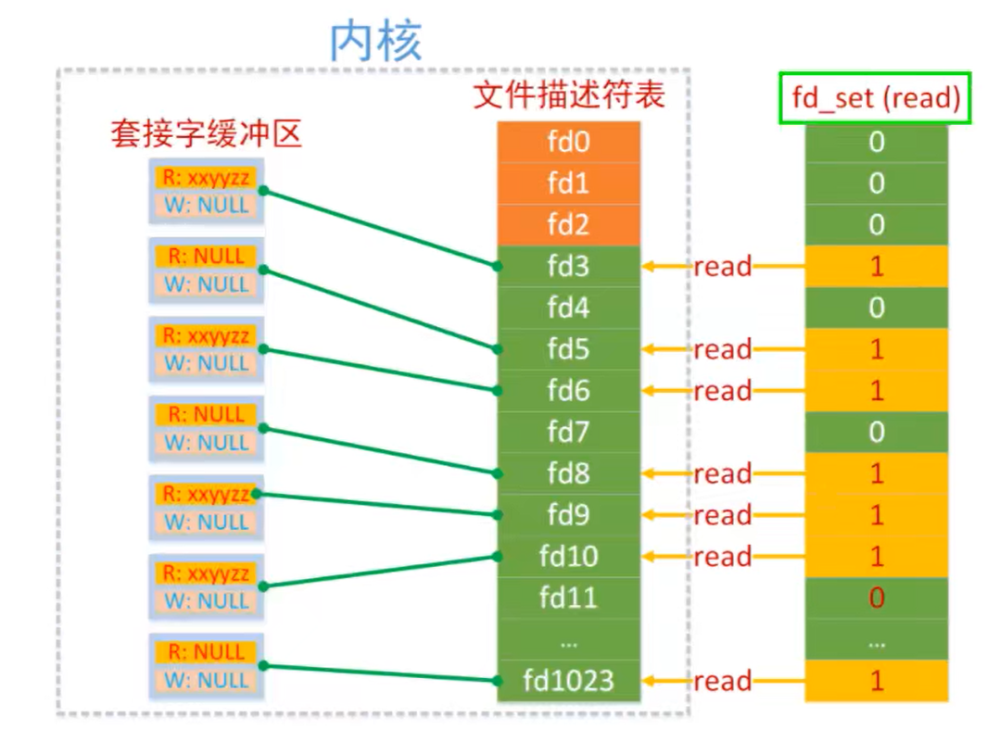内核在顺序遍历这个读集合的过程中,如果被检测的文件描述符对应的读缓冲区中没有数据,内核将修改这个文件描述符在读集合`fd_set`中对应的标志位,改为0,如果有数据那么标志位的值不变,还是1

    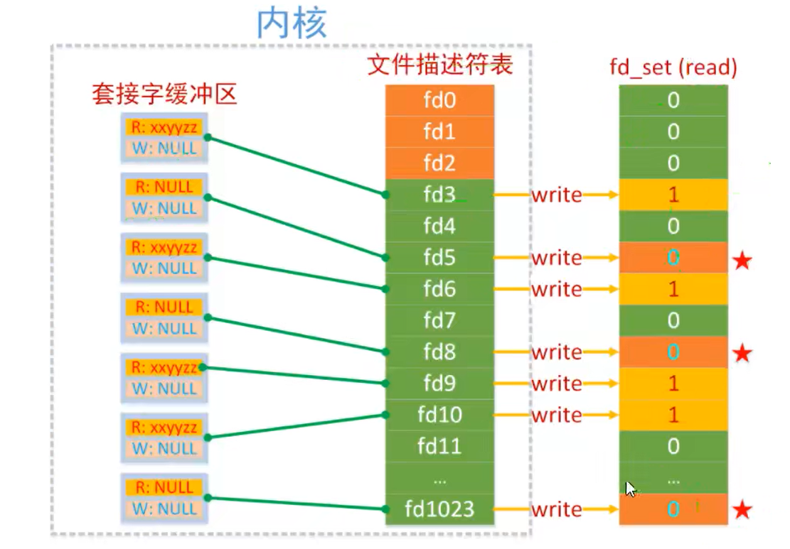当`select()`函数解除阻塞后,被内核修改过的读集合通过参数传出,此时集合中只要标志位的值还为1,那么它对应的文件描述符肯定是就绪的,我们就可以基于这个文件描述符和客户端建立新连接或通信了
16. 相关操作函数:
    ```C++
    1. FD_ZERO(fd_set *set);//清空文件描述符集合.它将给定的fd_set数据结构中的所有位置都设置为0
    2. FD_SET(int fd, fd_set *set);//将指定的文件描述符fd添加到文件描述符集合中.这意味着将fd对应的位设置位1,表示该文件描述符处于就绪状态.在调用select之前,应该使用此函数将要监视的文件描述他添加到fd_set中
    3. FD_ISSET();//检查指定的文件描述符fd是否在文件描述符集合中被设置.如果fd对应的位=1,则表示该文件描述符处于就绪状态,该函数返回非零值;否则返回0.通常在调用select后使用此函数检查哪些文件描述符已准备好进行I/O操作
    4. FD_CLR();//将指定的文件描述符fd从文件描述符集合中清除.这意味着将fd对应的位设置为0,表示不再监视该文件描述符
    ```
17. IO多路复用的优点:
    * 资源节约:IO多路复用可以通过一个线程同时监视多个IO事件,而不是为每个IO事件创建一个线程或进程
    * 高并发性:通过IO多路复用,一个线程可以同时处理多个IO时间,因此能够更高效地处理大量并发连接
    * 低延迟
    * 简化代码逻辑
18. IO操作与IO事件:IO操作是程序执行的输入输出动作.而IO事件是与这些IO操作相关的事件,通知程序何时可以执行这些操作
    * IO操作:指的是程序进行的输入和输出操作.输入操作指从外部读取数据到程序中,如从磁盘读取文件或从网络接收数据;输出操作是指将程序中的数据发送到外部,如将数据写入磁盘文件或通过网络发送数据
    * IO事件:指的是输入/输出操作发生或完成时发生的事件.在事件驱动编程中(`select poll epoll`),当某个IO操作准备就绪时,会产生一个IO事件,通知程序可以执行相应的IO操作.在计算机系统中,IO事件通常与IO操作相关联,例如从文件读取数据、向网络发送数据等,具体IOP事件包括:
      * 可读事件:当一个IO通道(套接字、管道、文件等)中有数据可读时(如套接字的读缓冲区有数据时),会触发可读事件.此时也叫做读操作就绪
      * 可写事件:当一个IO通道有足够的空间可以接收新的数据时,会触发可写事件
      * 异常事件:当IO通道发生异常(如套接字连接中断、套接字错误等)时,会触发异常事件
19. `epoll`的相关操作函数:
    ```C++
    1. int epoll_create(int size);//创建epoll实例,通过一颗红黑树管理待检测集合,这个参数在新版linux已经没什么用了,只需给一个大于0的数就行
    2. int epoll_create1(int flags);//flags是一个整数,可以传递0或一个标志位EPOLL_CLOEXEC(意味着在调用exec函数时会关闭该文件描述符)
    3. int epoll_ctl(int epfd, int op, int fd, struct epoll_event* event);//管理红黑树上的文件描述符(添加、修改、删除)
    //epfd:epoll的文件描述符,epoll_create的返回值
    //op:指定epoll树上的操作.EPOLL_CTL_ADD、EPOLL_CTL_MOD、EPOLL_CTL_DEL等
    //fd:待操作的文件描述符
    //event:文件描述符fd对应的事件(如:读事件、写事件、异常事件)
    4. int epoll_wait(int epfd, struct epoll_event* events, int maxevents, int timeout);//检测epoll树中是否有就绪的文件描述符,返回值是就绪文件描述符的个数
    //maxevents:指定events数组的最大容量
    //events:就是内核将就绪事件复制到的用户空间
    ```
20. 在服务器端使用`epoll`:
    * 创建`epoll`实例(树):`int epfd = epoll_create1(0);`
    * 将用于监听的套接字添加到`epoll`树中:
        ```C++
        struct epoll_event ev;
        ev.events = EPOLLIN;
        ev.data.fd = lfd;
        int ret = epoll_ctl(epfd, EPOLL_CTL_ADD, lfd, &ev);
        ```
    * 检测添加到`epoll`树的文件描述符是否就绪:`int num = epoll_wait(epfd, evs, size, -1);`
      - 如果是监听描述符,则建立连接:
        ```C++
        int cfd = accept(curfd, NULL, NULL);
        ev.events = EPOLLIN;
        ev.data.fd = cfd;
        epoll_ctl(epfd, EPOLL_CTL_ADD, cfd, &ev);
        ```
      - 如果是通信文件描述符,则进行通信:
        ```C++
        int len = recv(curfd, buf, sizeof(buf), 0);
        if(len==0){
            epoll_ctl(epfd, EPOLL_CTL_DEL, curfd, NULL);
            close(curfd);
        } 
        else if(len>0){
            send(curfd, buf, len, 0);
        }
        ```
21. `struct epoll_event`结构体:
    ```C++
    typedef union epoll_data{
        void *ptr;
        int fd;
        uint32_t u32;
        uint64_t u64;
    }epoll_data_t;

    struct epoll_event{
        uint32_t events;//EPOLLIN、EPOLLOUT、EPOLLRDHUP、EPOLLPRI、EPOLLERR、EPOLLHUP、EPOLLET等
        epoll_data_t data;//用户所操作的共用体数据(内核不会拿来用,用户写程序需要用,比如:使用其中的fd来记录此时的就绪的文件描述符的具体值),这个数据需要用户在epoll_ctl()前传入,一般是使用fd
    }
    ```
22. `epoll`效率比`select  poll`更高效的原因:
    * 事件通知方式:`epoll`使用事件通知的方式,而不是轮询
    * 文件描述符管理:`epoll`使用红黑树的数据结构来管理文件描述符,这使得`epoll`能快速处理大量的描述符,而不会随着文件描述符数量的增加而降低性能
    * 无限扩展性:`epoll`支持边缘触发模式,这意味着它能够处理非阻塞的IO
    * 内核空间与用户空间的拷贝次数减少:`epoll()`不会频繁的从用户空间拷贝文件描述符数据到内核空间,即`select poll`它们每次调用都可能会把之前拷贝过的文件描述符再拷贝(自己通过代码体会)
    * `epoll`可以使用`epoll_ctl()`一次性注册大量的文件描述符(使用`EPOLL_CTL_AD_BATCH`操作):
        ```C++
        int epfd = epoll_create(1);
        struct epoll_event events[MAX_EVENTS];
        // 设置事件类型
        for (int i = 0; i < MAX_EVENTS; ++i) {
            events[i].events = EPOLLIN;  // 这里只关心可读事件
            events[i].data.fd = i + 1;   // 假设文件描述符从1开始
        }
        // 一次性注册多个文件描述符
        int ret = epoll_ctl(epfd, EPOLL_CTL_ADD_BATCH, 1, events);//此时的fd=1表示要注册的一系列文件描述符的起始位置
        ```
23. 拷贝过程指的是将数据从一个位置复制到另一个位置的操作(在网络编程中通常是内核空间和用户空间),即拷贝就是复制.拷贝过程需要CPU和内存等资源来完成,因此可能会消耗计算机的资源.只要使用了`recv send`就会发生拷贝,因此零拷贝技术就是代替了这两种函数(更常用的还是非零拷贝技术)
24. `epoll`虽然可以减少拷贝次数,但是还是不能单独实现零拷贝.网络编程中的零拷贝技术:
    ```C++
    1. sendfile(int out_fd, int in_fd, off_t *offset, size_t count);//用于在两个文件描述符之间直接传输数据,而无需经过用户空间
    //out_fd：目标文件描述符，通常是一个套接字描述符，用于将数据发送到网络
    //in_fd：源文件描述符，通常是一个文件描述符(不能是管道和socket)，用于读取数据
    //offset：指定从源文件的哪个位置开始读取数据，通常设为 NULL，表示从文件当前位置开始读取
    //count：要传输的字节数
    2. splice(int fd_in, loff_t *off_in, int fd_out, loff_t *off_out, size_t len, unsigned int flags);//用于在两个文件描述符之间移动数据,而不需在用户空间和内核空间之间进行数据拷贝
    3. mmap(void *addr, size_t length, int prot, int flags, int fd, off_t offset);//应用程序调用mmap(),将内核空间(文件(通过文件描述符表示))映射到用户空间(用户内存:堆、栈等)中去        网络编程中常见:套接字->用户空间
    //addr：指定映射的起始地址，通常设置为NULL，让系统自动选择适当的地址
    //length：映射到内存的长度，单位是字节
    //prot：指定映射区的保护方式
    //flags：映射的标志
    //fd：指要映射的文件描述符
    //offset：指定文件的偏移量
    ```
    虽然它们只是操作的文件描述符,但它们实际操作的是一一对应的文件数据,而不仅仅是文件描述符本身
25. 下面是一个使用`splice epoll`的网络编程中零拷贝技术实现:
    ```C++
    #define MAX_EVENTS 10
    #define BUF_SIZE 1024
    int main() {
        int listen_fd, conn_fd, epoll_fd, nfds, i;
        struct epoll_event ev, events[MAX_EVENTS];
        char buf[BUF_SIZE];    
        // 创建监听socket
        listen_fd = socket(AF_INET, SOCK_STREAM, 0);
        if (listen_fd == -1) {
            perror("socket");
            exit(EXIT_FAILURE);
        }     
        // 绑定地址和端口
        struct sockaddr_in addr;
        memset(&addr, 0, sizeof(addr));
        addr.sin_family = AF_INET;
        addr.sin_addr.s_addr = htonl(INADDR_ANY);
        addr.sin_port = htons(8080);    
        if (bind(listen_fd, (struct sockaddr *)&addr, sizeof(addr)) == -1) {
            perror("bind");
            exit(EXIT_FAILURE);
        }  
        // 监听连接
        if (listen(listen_fd, 10) == -1) {
            perror("listen");
            exit(EXIT_FAILURE);
        }     
        // 创建 epoll 实例
        epoll_fd = epoll_create1(0);
        if (epoll_fd == -1) {
            perror("epoll_create1");
            exit(EXIT_FAILURE);
        }  
        // 将监听 socket 添加到 epoll 实例中
        ev.events = EPOLLIN;
        ev.data.fd = listen_fd;
        if (epoll_ctl(epoll_fd, EPOLL_CTL_ADD, listen_fd, &ev) == -1) {
            perror("epoll_ctl: listen_fd");
            exit(EXIT_FAILURE);
        }  
        while (1) {
            // 等待事件发生
            nfds = epoll_wait(epoll_fd, events, MAX_EVENTS, -1);
            if (nfds == -1) {
                perror("epoll_wait");
                exit(EXIT_FAILURE);
            }      
            // 处理就绪事件
            for (i = 0; i < nfds; i++) {
                if (events[i].data.fd == listen_fd) {
                    // 有新连接
                    conn_fd = accept(listen_fd, NULL, NULL);
                    if (conn_fd == -1) {
                        perror("accept");
                        exit(EXIT_FAILURE);
                    }
                    // 将新连接的 socket 设置为非阻塞模式
                    if (fcntl(conn_fd, F_SETFL, fcntl(conn_fd, F_GETFL) | O_NONBLOCK) == -1) {
                        perror("fcntl");
                        exit(EXIT_FAILURE);
                    }
                    // 将新连接的 socket 添加到 epoll 实例中
                    ev.events = EPOLLIN | EPOLLET; // 使用边缘触发模式
                    ev.data.fd = conn_fd;
                    if (epoll_ctl(epoll_fd, EPOLL_CTL_ADD, conn_fd, &ev) == -1) {
                        perror("epoll_ctl: conn_fd");
                        exit(EXIT_FAILURE);
                    }
                } else {
                    // 有数据可读
                    int pipe_fds[2];
                    if (pipe(pipe_fds) == -1) {
                        perror("pipe");
                        exit(EXIT_FAILURE);
                    }
                    ssize_t bytes_spliced = splice(events[i].data.fd, NULL, pipe_fds[1], NULL, BUF_SIZE, SPLICE_F_MOVE | SPLICE_F_MORE);//events[i].data.fd->pipe_fds[1];将events[i].data.fd套接字上的数据写到pipe_fds[1]管道文件描述符中(pipe[1]是写端)
                    if (bytes_spliced == -1) {
                        perror("splice");
                        exit(EXIT_FAILURE);
                    }
                    bytes_spliced = splice(pipe_fds[0], NULL, events[i].data.fd, NULL, bytes_spliced, SPLICE_F_MOVE | SPLICE_F_MORE);//pipe_fds[0]->events[i].data.fd
                    if (bytes_spliced == -1) {
                        perror("splice");
                        exit(EXIT_FAILURE);
                    }
                    close(pipe_fds[0]);
                    close(pipe_fds[1]);
                }
            }
        } 
        // 关闭监听 socket
        close(listen_fd);
        return 0;
    }
    ```
26. 事件通知方式:
    * `select`:使用轮询方式,即程序会主动的反复询问内核每个文件描述符是否有(IO)事件发生.`select`发生轮询主要是在阻塞等待的步骤处,在调用`select`函数后,程序会进入阻塞状态,等待文件描述符上的事件发生,这个等待过程实际上是通过<mark>程序不断主动轮询所有的文件描述符</mark>来完成的
    * `epoll`:使用事件通知的方式,当文件描述符上有(IO)事件发生时,内核会主动通知程序,而不需要程序不断地询问.`epoll`通过内核通知的机制：
        - 就绪事件列表:内核维护了一个就绪事件列表,当程序调用`epoll_ctl()`函数向`epoll`实例注册文件描述符时,内核会在内部维护一个数据结构来管理这些文件描述符及对应的事件,当文件描述符上有事件发生时,内核就会将这些就绪事件添加到就绪事件列表中.就绪事件列表是由内核自动维护的,程序无需显式操作
        - 用户态缓冲区:当程序调用`epoll_wait()`函数时,<mark>内核就会主动将就绪事件从内核空间复制到用户空间的缓冲区</mark>中,程序可以从这个缓冲区中读取就绪事件
27. <span style="color:red;">在服务器使用`select  poll  epoll`的构造流程都是类似的,思路都是一致的.如:对于就绪的文件描述符要分成监听文件描述符和通信文件描述符两种情况单独处理</span>
28. `epoll`的水平触发模式(LT):LT也是默认工作模式.其特点:
    * 读事件:如果文件描述符对应的读缓冲区还有数据,读事件就会被触发,`epoll_wait()`解除阻塞
        - 当读事件被触发,`epoll_wait()`解除阻塞,之后就可以接收数据了
        - 如果接收数据的buf很小,不能全部将缓冲区数据读出,那么读事件会继续被触发,直到数据被全部读出,如果接收数据的内存相对较大,读数据的效率也会较高
    * 写事件:如果文件描述符对应的写缓冲区可写,写事件就会被触发,其特点:
        - 当写事件被触发,`epoll_wait()`解除阻塞,之后就写入数据了
        - 如果写缓冲区没有被写满,写事件会一直被触发
29. `epoll`的边沿触发模式(ET),ET模式在很大程度上减少了`epoll`事件被重复触发的次数,因此效率要比`LT`模式高:
    * 读事件:当读缓冲区有新的数据进入,读事件被触发一次,没有新数据不会触发该事件
        - 如果有新数据进入到读缓冲区,该事件被触发,`epoll_wait()`解除阻塞
        - 如果数据没有被全部读走,并且没有新数据进入(即没有新的读事件),那么读事件就不会再次被触发(注:不会清空缓冲区)(这种情况只是针对通信套接字符中的`read/recv`,而`accept`是不会读不完的)
        - 如果数据被全部读走或只读走一部分,此时有新数据进入,读事件被触发,并且还是只通知一次 
    * 写事件:当写缓冲区状态可写,写事件只会触发一次
        - 如果写缓冲区可写,写事件被触发,`epoll_wait()`解除阻塞
        - 写缓冲区从不满到被写满,期间写事件只会被触发一次
        - 写缓冲区从满到不满,状态会变为可写,写事件只会被触发一次
30. 设置ET模式:
    ```C++
    ev.events = EPOLLIN | EPOLLET;//读事件+ET模式
    ```
31. 总的来说,`epoll`的`ET`模式下`epoll_wait()`检测到文件描述符有新事件才会再次通知,如果不是新的事件就不会通知,通知的次数比LT模式少,效率更高  
32. 通俗理解:`ET`模式就是要文件描述符一次就绪后,就要把事件做完,如果没做完,就会自动留到下一次解除`epoll_wait`阻塞才会被一起做(如:如果数据只被读走一部分,此时如果没有新数据进入,那么下一次`epoll_wait()`的时候这个文件描述符是不就绪的;如果有新数据进入,读事件才会再被触发);`LT`模式就是可以慢慢完成事件,没做完下一次还是就绪状态
33. `epoll`使用ET模式:
    * <mark>`epoll`在边沿模式下,必须要将套接字设置为非阻塞模式</mark>(不然会在最后一次读(写)完(满)缓冲区时会一直阻塞在`recv`(`send`)).此时会引发一个bug,在非阻塞模式下,当缓冲区读(写)完(满),再调用`recv`(`send`)函数会继续从(向)缓冲区读(写)数据,此时就会直接返回错误代码,对应的全局变量`errno`被设置为`EAGAIN/EWOULDBLOCK`,所以此时应该直接判断`erron`是否为`EAGAIN`,进而来知道是否缓冲区空(满)了
    * 将套接字默认的阻塞行为修改为非阻塞:
        ```C++
        #include <fcntl.h>
        
        int flag = fcntl(cfd, F_GETFL);
        flag |= O_NONBLOCK;
        fcntl(cfd, F_SETFL, flag);
        ```
34. `epoll`相关的操作函数是线程安全的函数,所以对这些函数操作时不需要加锁
35. `select()    epoll_wait()`在等待就绪文件描述符时都是阻塞的
36. IO操作包括IO调用(应用程序),IO执行(操作系统内核)
37. IO多路复用会阻塞在两个地方:
    * `select()  poll()  epoll_wait()`
    * 具体的IO操作,如:`recv()  accept()  send()`
38. 在现代操作系统中,内存地址空间通常分为用户空间和内核空间.用户空间:用户程序提供的一块内存区域,用于存放用户程序的执行代码、数据以及用户空间所需的系统资源(自己写的代码中的那些变量(堆、栈、全局数据段)就是用户空间);内核空间:用户程序无法直接访问内核空间,必须通过系统调用接口(`socket`)来请求内核执行相关操作.内核空间是操作系统内存的一部分,用于存储操作系统内核及其数据结构、驱动程序和操作系统管理代码.内核空间与用户空间分离,以保护内核和关键系统数据的安全性和稳定性,并确保用户进程不会直接干扰内核的操作
# Reactor和Proactor
1. `Reactor`是一种事件驱动的设计模式,用于构建高效的并发应用程序.`select()  poll()  epoll()`是`linux`中用于实现`Reactor`模式的IO多路复用系统调用,即可以看作是`Reactor`模式的一种具体实现方法
2. 虽然`select()`的事件通知方式是使用轮询,但它也是基于事件驱动的
3. `reactor`模型是网络服务器端用来处理高并发IO请求的模型
4. `reactor`模型有三个角色:
   * `reactor`:负责事件监听和事件分发->(`select  epoll_wait等`)
   * `acceptor`:负责连接事件(`accept`)
   * `handler`:负责读写事件(`recv  send`)
5. `reactor`三种模型:
   * 单线程:`reactor acceptor handler`都是一个线程执行
   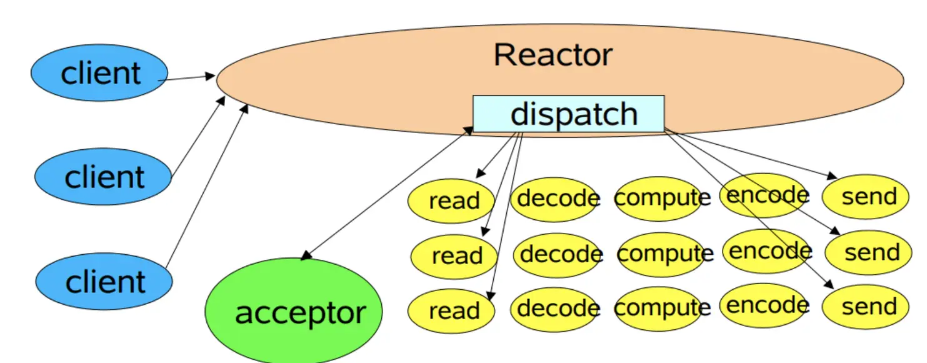
   * 多线程:`reactor acceptor handler`都是一个线程执行,但是与此同时,会有一个线程池由若干`worker`线程组成,即此时的`handler`只负责读取请求`recv`和写回结果`send`,而具体的业务处理由`worker`线程完成
   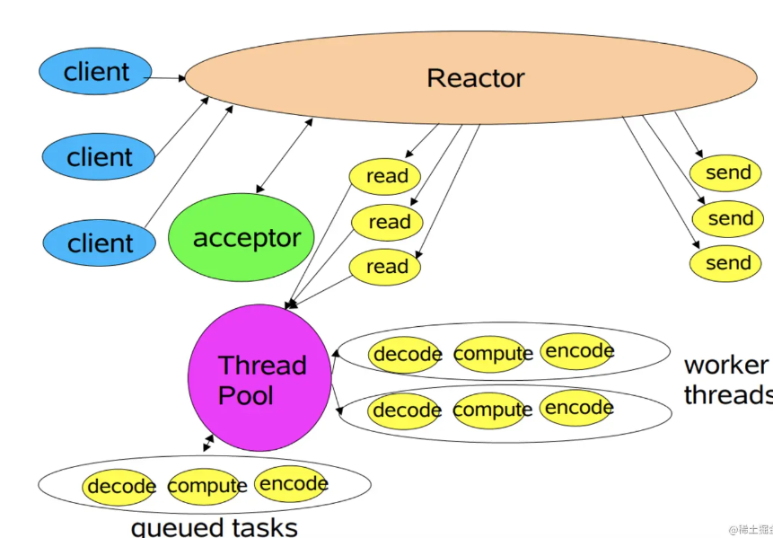
   * 主从多线程:一个主`reactor`线程:负责监听客户端事件,并在线程中让`acceptor`处理连接,即`select()+accept()`.多个子`reactor`线程负责连接后的后续事件处理,如`recv  send`,而具体的业务处理函数会让`worker`线程完成,即此时是相对于多线程把`handler`给放在子`reactor`线程处理了
   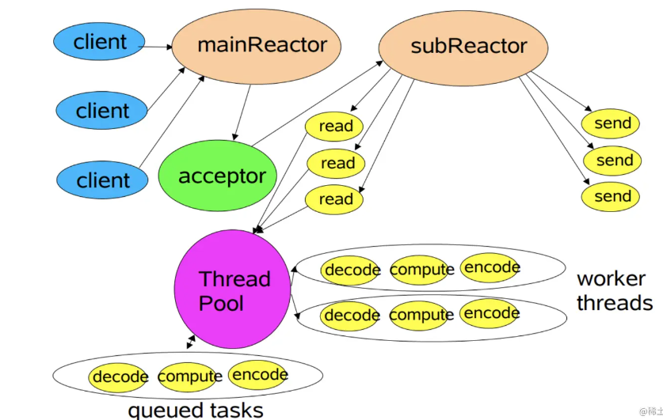
6. `reactor`模式是一种事件驱动的模式,所以使用`select() poll() epoll()`进行IO多路复用的服务端也就是采用了`reactor`设计模式
7. `《Linux高性能服务器编程》`中说`reactor`在高并发处理时要设计成主线程只负责监听(`select epoll_wait`)文件描述符上是否有事件发生,而不做任何其它实质性的工作.`accept recv send`以及对应的`task`都要在工作线程中完成
   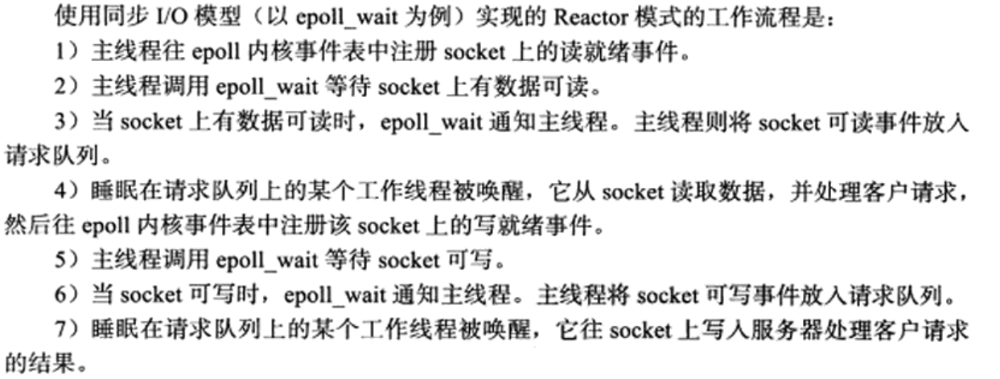
8. 虽然`select()`在实现上可能采用了不同的机制(如轮询或底层操作系统提供的事件通知机制),但从调用者的角度来看,它确实是基于事件驱动的,因为程序会在事件发生时被唤醒并处理相应的事件
9. 与`reactor`模式不同,`proactor`模式将所有IO操作(`accept recv send`)都交给主线程和内核(异步则操作系统(内核)来IO操作)来处理,工作线程仅负责处理逻辑
10. `reactor`是同步IO模式,`proactor`是异步IO模式,它感知的是已完成的读写事件.在发起异步读写请求时,需要传入数据缓冲区的地址(用来存放结果数据)等信息,这样系统内核才可以自动帮我们把数据的读写工作完成,这里的读写工作全程由操作系统(内核)来做,而主线程可以处理其它逻辑
11. `reactor`和`proactor`都是基于事件驱动的网络编程模式,区别在于`reactor`模式是基于<mark>就绪</mark>的IO事件,而`proactor`模式则是基于<mark>已完成</mark>的IO事件(内核已完成IO操作,那么此时内核会通知主线程).`proactor`关注的是完成事件而不是就绪事件,`proactor`工作流程:
    * 主线程调用`aio_read`函数向内核注册`socket`上的读完成事件,并告诉内核用户读缓冲区的位置,以及读操作完成时如何通知应用程序(这里以信号为例)
    * 主线程继续处理其他逻辑
    * 当 `socket` 上的数据被读入用户缓冲区后(即此时的读操作完成了),内核将向应用程序发送一个信号,以通知应用程序数据已经可用
    * 应用程序预先定义好的信号处理函数选择一个工作线程来处理客户请求.工作线程处理完客户请求后,调用`aio_write`函数向内核注册`socket`上的写完成事件,并告诉内核用户写缓冲区的位置,以及写操作完成时如何通知应用程序(这里以信号为例)
    * 主线程继续处理其他逻辑
    * 当用户缓冲区的数据被写入`socket`之后,内核将向应用程序发送一个信号,以通知应用程序数据已经发送完毕
    * 应用程序预先定义好的信号处理函数选择一个工作线程来做善后处理,比如决定是否关闭`socket`
   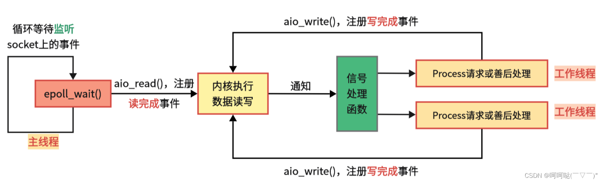
12. <mark>如果程序是计算密集型的,并发编程没有优势,反而由于任务的切换使效率降低;但如果程序使IO密集型的,比如经常读写文件,访问数据库等,则情况不同,此时并发编程很高效.由于IO操作的速度远没有CPU的计算速度快,所以让程序阻塞于IO操作将浪费大量的CPU时间</mark>
13. Linux2.6后才引入异步AIO接口`aio_read() aio_write()`等,对于实际应用中,大部分都是直接采用`reactor`模式
