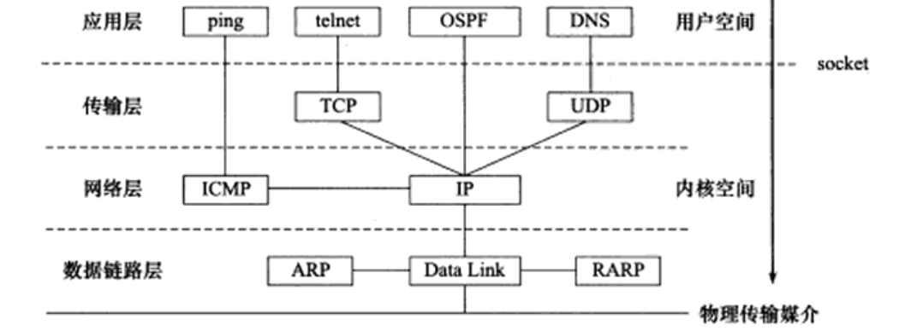
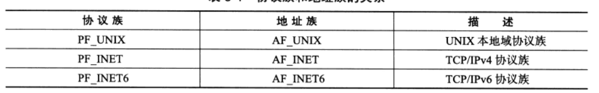
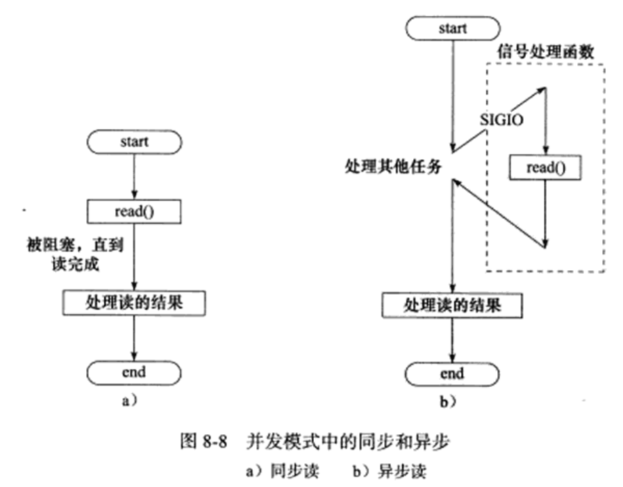

# 第一章 TCP/IP协议详解
1. TCP/IP协议族是一个四层协议系统.
   
2. 应用层在用户空间实现,不在内核中实现
3. 应用层:`ping`是应用程序,不是协议;`telnet`是远程登录协议;`DNS`是域名到IP转换的协议;`OSPF`是动态路由更新协议
4. `ARP`:IP->MAC;`ARP`维护一个高速缓存,其中包含经常访问或最近访问的机器的IP地址到物理地址的映射.这样就避免了重复的`ARP`请求,提高了发送数据包的速度
5. `WSL`下的DNS的IP地址是与windows本机一样的,可以直接使用`host -t A www.baidu.com`查看百度域名对应的IP
6. 应用程序-用户缓冲区;内核-内核缓冲区
7. 数据链路层、网络层、传输层协议是在内核中实现的.因此操作系统需要实现一组系统调用,使得应用程序能够访问这些协议提供的服务.实现这组系统调用的API为`socket`.由`socket`定义的API主要提供两点功能:
   * 将应用程序数据从用户缓冲区中复制到TCP/UDP内核发送缓冲区,以交付内核来发送数据;或者是从内核TCP/UDP接收缓冲区中复制数据到用户缓冲区,以读取数据
   * 应用程序可通过它们来修改内核中各层协议的某些头部信息或其它数据结构,从而精细地控制底层通信的行为
# 第2章 IP协议详解
1. IP协议是无状态、无连接、不可靠的
2. 网关:指连接两个不同网络的设备或系统,充当数据传输的中转站,帮助实现不同网络之间的通信和数据交换
3. 网卡:计算机用于连接到网络的硬件设备,也称为网络适配器或网络接口卡.一个计算机可以有多个网卡,如windows有以太网网卡(有线以太网电缆)、wifi网卡(网卡扫描wifi热点->认证热点,建立wifi连接->网卡向DHCP服务器请求IP地址(使计算机能够在网络中被识别)->计算机通过网卡连接到了网络)、蓝牙网卡
4. 每个网卡都有一个IP,平时所说的计算机IP,其实就是网卡IP
5. 当更改Wi-Fi热点时,连接到热点的设备的IP地址通常会发生变化.这是因为每个Wi-Fi热点都有自己的DHCP服务器负责为连接到该热点的设备分配IP地址
# 第17章 系统监测工具
1. `webbench`:压测工具
2. `tcpdump`:网络抓包工具
3. `iosf`:列出当前系统打开的文件描述符的工具(`-i`显示`socket`文件描述符)
4. `nc`:主要被用来快速构建网络连接.它可以以服务器方式运行,监听某个端口并接收客户连接,因此它可用来调试客户端程序.它也可以客户端方式运行,向服务器发起连接并接收数据,因此可用来调试服务器程序
5. `strace`:测试服务器性能的重要工具
6. `netstat`:它是网络信息统计工具.它可以打印本地网卡接口上的全部连接、路由表信息、网卡接口信息等
7. `vmstat`:它能实时输出系统的各种资源的使用情况,比如:进程信息、内存使用、CPU使用率以及I/O使用情况
8. `ifstat`:简单的网络流量监测工具
9.  `mpstat`:它能实时监测多处理器系统上每个CPU的使用情况
# 第5章 Linux网络编程基础API
1. 大端字节序:一个整数的高位字节(23~31 bit)存储在内存的低地址处,低位字节(0~7 bit)存储在内存的高地址处
2. 小端字节序:一个整数的高位字节(23~31 bit)存储在内存的高地址处,低位字节(0~7 bit)存储在内存的低地址处
3. 现代PC大多采用小端字节序,因此<mark>小端字节序又被称为主机字节序</mark>
4. <mark>大端字节序也称为网络字节序</mark>
5. 同一台机器上的两个进程也要考虑字节序问题,如`JAVA`虚拟机采用的是大端字节序
6. `Linux`提供了4个函数:
   ```C++
   unsigned long int htonl();
   unsigned long int htons();
   unsigned long int ntohl();
   unsigned long int ntohs();
   //long型函数常用来转换IP地址,short常用来转换端口号
   ```
7. `sockaddr`结构体是通用的`socket`地址,但在实际使用中不好用,因为在设置会获取IP地址和端口号需要执行位操作,所以常用专用的`socket`地址结构体->`socketaddr_in`(ipv4)和`sockaddr_in6`(ipv6)
   ```C++
      struct sockaddr{
      sa_family_t sa_family;//4字节,地址族类型变量
      char sa_data[14];//port(2字节)+IP地址(4字节)+填充(8字节)
   }
   ```
   需要注意<mark>:专用的`socket`结构体在实际使用时都需转化为通用`socket`地址类型`socketaddr`(强制类型转换),因为所有`socket`API使用的都是`socketaddr`</mark>,如:   
   ```C++
   bind(server_fd, (struct sockaddr *)&address, sizeof(address))
   ```
8. 地址族类型与协议族类型一一对应.其中宏`PF_*`和`AF_*`具有相同的值,所以通常混用,因此我在要用协议族的地方也直接写的`AF_*`
   
9.  点分十进制与网络字节序二进制表示的相互转换(ipv4):
   ```C++
   in_addr_t inet_addr(const char* strptr);//将点分十进制字符串表示的IPV4地址转化为用网络字节序整数表示的IPV4地址,typedef uint32_t in_addr_t
   int inet_aton(const char* cp, struct in_addr* inp);//将点分十进制的IPV4转换为网络字节序的二进制格式
   char* inet_ntoa(struct in_addr in);//将网络字节序的二进制格式转化为点分十进制的IPV4

   struct in_addr{
      uint32_t s_addr;//存储IPv4地址,以网络字节序存储
   }
   //inet_addr和inet_aton函数功能一样,但是inet_aton将转化结果存储与参数inp执行的地址结构图中去,而不是直接返回
   //inet_ntoa不可重入,即第二次调用它就会覆盖第一次的结果,这是线程不安全的
   ```
10. 同时适用IPV4和IPV6的地址转换函数:
   ```C++
   int inet_pton(int af, const char* src, void* dst);//af参数指定地址族,即可以是AF_INET或AF_INET6.函数成功返回1,失败返回0
   const char* inet_ntop(int af, const void* src, char* dst, socklen_t cnt);//cnt表示目标存储单元大小,可以设为:INET_ADDRSTRLEN或INET6_ADDRSTELEN,它们分别是表示IPV4和IPV6地址大小的宏.函数成功返回目标存储单元的地址,即dst;失败则返回NULL
   ```
11. <mark>套接字(`socket`)地址=(特定通信端点的)IP地址+端口号</mark>
12. `socket`原型:
   ```C++
    int socket(int domain, ine type, int protocol);
    //domain:底层协议族.对于TCP/IP协议族=AF_INET(IPV4),AF_INET6(IPV6)
    //type:服务类型有SOCK_STREAM服务(流服务),SOCK_UGRAM服务(数据报).对于TCP/IP协议族,传输层使用TCP协议则type=SOCK_STREAM,使用UDP则type=SOCK_DGRAM
    //protocol:它是表示在前两个参数构成的协议集合下,再选择一个具体的协议,不过前两个参数已经完成决定了它的值,所以几乎所有情况下,都把它设为0,表示使用默认协议
    //失败返回-1,成功返回一个socket文件描述符
   int sockfd = socket(AF_INET, SOCK_STREAM, 0); // 对于 TCP/IPV4
   int sockfd = socket(AF_INET, SOCK_DGRAM, 0);  // 对于 UDP/IPV4
   ```
13. 命令`socket`
    ```C++
    int bind(int sockfd, const struct sockaddr* my_addr, socklen_t addrlen);
    //bind将my_addr所指的socket地址分配给未命名的sockfd文件描述符
    //成功返回0,失败返回-1
    ```
14. 监听`socket`:
    ```C++
    int listen(int sockfd, int backlog);
    //sockfd指定被监听的socket
    //backlog提示内核监听队列的最大长度
    //成功返回0,失败返回-1
    ```
15. 接受连接:
    ```C++
    int accept(int sockfd, struct sockaddr* addr, socklen_t* addrlen);
    //sockfd是执行过listen系统调用的监听socket
    //addr用来获取被接受连接的远端socket地址(服务器本地socket地址)
    //成功返回通信socket,失败返回-1
    ```
16. 客户端发起连接:
    ```C++
    int connect(int sockfd, const struct sockaddr* serv_addr, socklen_t addrlen);
    //sockfd是客户端监听套接字
    //serv-addr是服务器的socket地址
    //成功返回0,失败返回-1
    ```
18. 关闭连接:
    ```C++
    int close(int fd);
    //close系统调用并非总是立即关闭一个连接,而是将fd的引用计数减1.只有当fd的引用计数为0时,才真正关闭连接
    ```
19. TCP数据读写:
    ```C++
    ssize_t recv(int sockfd, void* buf, size_t len, int flags);
    ssize_t send(int sockfd, const void* buf, size_t len, int flags);
    //flags通常设为0
    ```
20. UDP数据读写:
   ```C++
    ssize_t recvfrom(int sockfd, void* buf, size_t len, int flags, struct sockaddr* src_addr, socklen_t* addrlen);
    ssize_t sendto(int sockfd, const void* buf, size_t len, int flags, const struct sockaddr* dest_addr, socklen_t addrlen);
    //因为UDP通信没有连接的概念,所以每次读取数据都需要获取发送端的socket地址,即参数src_addr进而dest_addr
   ``` 
   `UDP`通信的简例: 
   ```C++
   #include <stdio.h>
   #include <stdlib.h>
   #include <string.h>
   #include <unistd.h>
   #include <arpa/inet.h>
   #include <sys/socket.h>
   #define PORT 8080
   #define BUF_SIZE 1024
   int main() {
      int sockfd;
      char buffer[BUF_SIZE];
      struct sockaddr_in server_addr, client_addr;
      socklen_t addr_len = sizeof(client_addr);   
      // 创建一个 UDP 套接字
      sockfd = socket(AF_INET, SOCK_DGRAM, 0);
      if (sockfd == -1) {
         perror("socket");
         exit(EXIT_FAILURE);
      }
      // 初始化服务器地址结构
      memset(&server_addr, 0, sizeof(server_addr));
      server_addr.sin_family = AF_INET;
      server_addr.sin_addr.s_addr = INADDR_ANY;
      server_addr.sin_port = htons(PORT);
      // 绑定套接字到本地地址和端口
      if (bind(sockfd, (struct sockaddr *)&server_addr, sizeof(server_addr)) == -1) {
         perror("bind");
         close(sockfd);
         exit(EXIT_FAILURE);
      }
      printf("Server is listening on port %d\n", PORT);

      while (1) {
         // 接收数据
         ssize_t recv_len = recvfrom(sockfd, buffer, BUF_SIZE, 0, (struct sockaddr *)&client_addr, &addr_len);
         if (recv_len == -1) {
               perror("recvfrom");
               close(sockfd);
               exit(EXIT_FAILURE);
         }
         // 输出接收到的数据和发送方地址信息
         buffer[recv_len] = '\0';
         printf("Received message: %s\n", buffer);
         printf("From IP: %s, Port: %d\n",
                  inet_ntoa(client_addr.sin_addr),
                  ntohs(client_addr.sin_port));
      }
      close(sockfd);
      return 0;
   }
   ```
21. 通用数据读写(了解即可):
   ```C++
    ssize_t recvmsg(int sockfd, struct msghdr* msg, int flags);
    ssize_t sendmsg(int sockfd, struct msghdr* msg, int flags);
    //flags通常设为0
   ```
22. 地址信息函数(便于程序调试输出):
    ```C++
    int getsockname(int sockfd, struct sockaddr* address, socklen_t* address_len);
    //获取sockfd套接字关联的本地地址(ip和port),并将其存储于address
    int getpeername(int sockfd, struct sockaddr* address, socklen_t* address_len);
    //获取sockfd对应的远端socket地址(对等方的ip和port),并将其存储于address.它常用于在客户端和服务器之间连接建立后获取对方的地址信息
    ```
23. <mark>`socket`默认是阻塞的,即它里面的`connect accept  recv  send`等这些是阻塞函数</mark>,可以直接将套接字设为非阻塞,此时对应的API函数都是非阻塞的了
24. <span style="color:red;">在网络编程中,`INADDR_ANY`是特殊的常量,通常用于服务器端套接字的绑定操作,以指示服务器可以接受来自任何网络接口的连接请求.具体来说,`INADDR_ANY`的值为`0.0.0.0`,它可以使服务器监听服务器所在的主机上的所有IP地址(主机可能有多个网卡,如以太网和无线,或多重IP地址),此时不管连接请求是通过哪个接口或哪个IP地址发送过来的,服务器都能接受</span>
25. 在客户端中,`connect`用于将客户端套接字连接到指定的服务器地址和端口,如果是写的`127.0.0.1`,那么表示服务器也在客户端的本机上:
    ```C++
    serv_addr.sin_family = AF_INET;
    serv_addr.sin_port = htons(80);
    if(inet_pton(AF_INET, "127.0.0.1", &serv_addr.sin_addr) <= 0) {
        std::cerr << "Invalid address/ Address not supported" << std::endl;
        return -1;
    }
    // 连接服务器IP和端口
    if (connect(sock, (struct sockaddr *)&serv_addr, sizeof(serv_addr)) < 0){//server_ip = "127.0.0.1",表示服务器在本地主机上
        std::cerr << "Connection error" << std::endl;
        return -1;
    }
    ```
26. `socket`选项(详细见<<Linux高性能服务器编程>>pp87):
    ```C++
   int getsockopt(int sockfd, int level, int option_name, void* option_value, socklen_t* restrict option_len);
   int setsockopt(int sockfd, int level, int option_name, consnt void* option_value, socklen_t option_len);
   如:
   int opt = 1;//对于SO_REUSEADDR,等于1表示启用选项
   if (setsockopt(server_fd, SOL_SOCKET, SO_REUSEADDR, &opt, sizeof(opt))) {
      std::cerr << "setsockopt" << std::endl;
      exit(EXIT_FAILURE);
   }
   //设置socket的选项SO_REUSEADDR可以强制使被处于TIME_WAIT状态的连接占用的socket地址,即此设置后即使sock处于TIME_WAIT状态,与之绑定的socket地址也可以立即被重用
   //opt=1表示启用这个选项
   ```
# 第6章 高级I/O函数
1. `pipe`函数可用于创建一个管道,以实现进程间通信:
   ```C++
   1. 
   int pipe(int fd[2]);
   //通过pipe函数创建的两个文件描述符fd[0]和fd[1]分别构成管道的读端和写端,不能反过来使用.默认情况下,它们是阻塞的
   //管道内部传输的是字节流,管道容量的大小默认是65536字节,可以使用fcntl修改管道容量
   2.
   int socketpair(int domain, ine type, int protocol, int fd[2]);//创建双向管道
   //前三个参数和socket()函数一样,domain只能是AF_UNIX
   //我们仅能在本地使用这个双向管道,它创建的这对fd[0]、fd[1]都是既可读又可写的
   ```
2. `dup`和`dup2`函数是复制一个文件描述符(不是复制的文件描述符表示的值),如:`dup2(cgi_output[1], 1)`:重定向子进程的标准输出到(输出)管道的写入端(即标准输出的内容被发送到管道的写入端而不是屏幕)
    ```C++
    int dup(int oldfd);//复制oldfd文件描述符并返回新的文件描述符,它指向与原文件描述符相同的文件表项,指向相同的文件表项则是指向相同的文件内容(地方)
    int dup2(int oldfd, int newfd);//使newfd指向与oldfd相同的文件表项.如果newfd已经被打开,dup2会首先关闭newfd;然后,将newfd复制为指向oldfd所指向的文件表项
    ```
3. <mark>文件描述符是操作系统内核为进程提供的一种抽象,用于访问和管理打开的文件或其它I/O资源(其它的I/O资源如管道和套接字等).它是一个非负整数,文件描述符指向与打开的文件或I/O资源相关的文件表项,文件描述符提供了一种统一的方式来操作不同类型的I/O资源.</mark>文件描述符->文件表项.通俗点理解,文件描述符就是关联(表征)一个文件或者一个I/O资源
4. 文件表项是操作系统内核中的数据结构,用于存储与已打开文件相关的状态信息.它是文件描述符与具体文件或I/O资源之间的桥梁.每个文件表项包含文件状态(用于记录文件的状态(如:是否阻塞,是否已达文件末尾等))、文件偏移量(当前文件读写操作的位置)、访问模式(文件打开时指定的访问模式(如:只读、只写、读写等))、引用计数(打开该文件表项的文件描述符数量)等,并指向实际的文件数据结构.<mark>当进程打开一个文件时,操作系统内核会:创建一个文件表项,存储该文化的状态信息;在进程的文件描述符表中分配一个文件描述符,这个文件描述符指向新创建的文件表项</mark>
5. `readv()  write()`函数分别表示将数据从文件描述符读到分散的内存块中(分散读)和将多块分散的内存数据一并写入文件描述符中(集中写)
6. 网络编程中的零拷贝技术:
    ```C++
    1. sendfile(int out_fd, int in_fd, off_t *offset, size_t count);//在两个文件描述符之间直接传递数据(完全在内核中操作),其中in_fd必须是具体文件的文件描述符
    //out_fd：目标文件描述符，通常是一个套接字描述符，用于将数据发送到网络
    //in_fd：源文件描述符，必须是指向真实文件的文件描述符(不能是管道和socket)，用于读取数据
    //offset：指定从源文件的哪个位置开始读取数据，通常设为 NULL，表示从文件当前位置开始读取
    //count：要传输的字节数
    2. splice(int fd_in, loff_t *off_in, int fd_out, loff_t *off_out, size_t len, unsigned int flags);//用于在两个文件描述符之间移动数据,而不需在用户空间和内核空间之间进行数据拷贝.splice函数中fd_in和fd_out必须至少有一个是管道文件描述符
    3. mmap(void *addr, size_t length, int prot, int flags, int fd, off_t offset);//应用程序调用mmap(),将内核空间(文件(通过文件描述符表示))映射到用户空间(用户内存:堆、栈等)中去        网络编程中常见:套接字->用户空间
    //addr：指定映射的起始地址，通常设置为NULL，让系统自动选择适当的地址
    //length：映射到内存的长度，单位是字节
    //prot：指定映射区的保护方式
    //flags：映射的标志
    //fd：指要映射的文件描述符
    //offset：指定文件的偏移量
      int munmap(void* start, size_t length);//释放由mmap创建的这段内存空间
    4. ssize_t tee(int fd_in, int fd_out, size_t len, unsigned int flags);//在两个管道文件描述符之间复制数据,也是零拷贝操作,它不消耗数据
    //fd_in和fd_out必须都是管道文件描述符
    ```
7. <mark>对文件描述符的各种控制操作:</mark>
   ```C++
   int fcntl(int fd, int cmd, ...);
   //fd是被操作的文件描述符
   //cmd指定执行何种类型的操作
   //根据操作类型的不同,该函数可能还需要第三个可选参数arg
   eg:
   int old_op = fcntl(fd, F_GETFL);//获取文件描述符fd的状态标志
   int new_op = old_op | O_NONBLOCK;//设置为非阻塞
   fcntl(fd, F_SETFL, new_op);
   ```
# 第8章 高性能服务器程序框架(从编程角度)
1. C/S模型当访问量过大时,可能所有客户都将得到很慢的响应.P2P模型使得每台机器在消耗服务的同时也给别人提供服务,这样资源能够充分、自由地共享,云计算机群可以看作P2P模型的一个典范
2. 阻塞的文件描述符为阻塞I/O,非阻塞的文件描述符为非阻塞I/O
3. `select poll epoll`这些I/O复用函数本身是阻塞的,它们能提高程序效率的原因在于它们具有同时监听多个I/O事件的能力
4. 同步I/O向应用程序通知的是I/O就绪事件,而异步I/O向应用程序通知的是I/O完成事件
5. 两种高效的事件处理模式:`Reactor  Proactor`
6. `Reactor`在高并发处理时要设计成主线程只负责监听(`select epoll_wait`)文件描述符上是否有事件发生,而不做任何其它实质性的工作.`accept recv send`以及对应的`task`都要在工作线程中完成
7. 两种高效的事件处理模式:`Reactor  Proactor`和两种高效的并发模式:`半同步/半异步`和`领导者/追随者`模式
8. 半同步/半异步中的同步和异步与I/O模型的同步、异步不同,这里的同步指的是程序完全按照代码序列的顺序执行,异步指的是程序的执行需要由系统事件来驱动(如:就绪事件、完成事件、信号、中断等,既在并发编程中`select poll epoll`就是一个异步)
   
   <mark>半同步/半异步模式中,同步线程用于处理客户逻辑(常用线程池),异步线程用于处理I/O事件(如`select poll epoll`).结合`Reactor Proactor`事件模式后就变成了半同步/半反应堆模式,此时又有两种情况:一种是监听和连接都在异步线程(主线程),其它客户逻辑在同步线程中;另一种是只有监听在异步线程,其它都在同步线程(这其实和前面所说的单纯的`Reactor`模式基本一样).后者在高性能编程中更好</mark>
9. 常见半同步/半反应堆模式结构:
    * 异步事件分发层(主线程):通过多路复用(如`select、poll、epoll`)来监控多个文件描述符,并将事件分发到相应的处理程序
    * 同步任务处理层:常用线程池(`ThreadPool pool()`)
    * 任务队列:用于在异步层和同步层之间传递任务(`pool.enqueue()`)
10. 领导者/追随者模式是多个工作线程轮流获得事件源集合,轮流监听、分发并处理事件的一种模式.在任意时间点,程序都仅有一个领导者线程,它负责监听I/O事件.而其它线程则是追随者.当前的领导者如果检测到I/O事件,首先要从线程池中推选出新的领导者线程,然后它自己处理I/O事件.此时,新的领导者等待新的I/O事件,而原来的领导者则处理I/O事件,二者实现了并发(详见<<Linux高性能服务器编程>>pp134)
11. 网络编程中的上下文切换=进程/线程切换,这个切换会占用大量的CPU时间
12. `accept`写在主线程的弊端:
    * 阻塞问题:`accept`函数是一个阻塞调用,这意味着当它在等待新的客户端连接时,主线程将被阻塞,无法处理其他任务.这会导致整个服务器在等待新连接时无法响应其他事件,从而降低系统的整体性能和响应速度
    * 可扩展性:当服务器需要处理大量并发连接时,单个主线程的`accept`处理方式会成为瓶颈
    * 并发处理的复杂性:在高并发场景下,如果`accept`在主线程中处理,那么需要在每次接收到新连接后立即将其分发到其他线程或进程进行处理.这种方式的上下文切换和线程同步会增加系统开销
# 第13章 多进程编程
1. `Linux`创建新进程的系统调用是`fork`:
   ```C++
   pid_t fork();
   ```
2. `fork`的每次调用都返回两次,在父进程中返回的是子进程的`PID`,在子进程中则返回0.该返回值是判断当前进程是父进程还是子进程的依据(注:`fork`调用生成的新进程与其父进程谁先执行不一定,哪个进程先执行要看系统的进程调度策略)
3. <mark>子进程的创建会复制父进程的代码段/数据段/BSS段/堆/栈等所有用户空间信息,它只是一个副本(即子进程会继承父进程的内存空间的副本),子进程和父进程对数据的修改不会相互影响.子进程的数据的复制采用的是写时复制,即只有在任一进程对数据执行了写操作时,复制才会发生</mark>
4. `C++`中全局变量的存储位置通常在:
   * 数据段:存储已初始化的全局变量和静态变量
   * BSS段:存储未初始化的全局变量和静态变量
   * 只读数据段:存储常量(如`const`修饰的全局变量)
5. <mark>因为多个线程是共用一个内存空间,所有其全局变量、静态变量和堆内存在同一进程的所有线程之间是共享的,但是各个线程对于局部变量是不会共享的,各个线程有自己独立的栈空间.对于进程,全局变量、静态变量和堆内存不能直接作为进程间的共享资源使用,因为每个进程都有独立的内存空间,进一步说子进程更不能直接使用主进程的局部变量了</mark>
6. <mark>在进程中全局变量不能作为共享资源,进程间共享资源大多用共享内存来体现,而管道、消息队列是用于进程间通信的方法,不属于共享资源的范畴</mark>
7. 共享内存本身不提供同步机制,只是一个共享资源的方法,此时可能会出现数据竞争和不一致情况,对于进程同步可以用:信号量、条件变量(信号量更常用)
8. <mark>父进程关闭自己的读端/写端不会影响子进程的读/写操作,因为父进程和子进程在`fork`之后拥有各自独立的文件描述符表.也就是说,父进程关闭自己的读端/写端不会关闭子进程中的读端/写端,子进程仍然可以正常读取/写入数据</mark>.
9. <span style="color:red;">父进程创建子进程后,父进程中打开的文件描述符默认在子进程中也是打开的,且文件描述符的引用计数+1.不仅如此,父进程的用户根目录、当前工作目录等变量的引用计数均会+1</span>
10. <mark>在`UNIX`系统中,文件描述符是进程内的资源,而不同进程之间的文件描述符表是独立的.因此,父进程和子进程在`fork`之后拥有独立的文件描述符表,但是这些文件描述符可能指向相同的底层文件或管道.因此,一个进程关闭某个文件描述符并不会直接关闭另一个进程的对应文件描述符,但是会影响共享的底层资源.具体来说,父进程和子进程在`fork`之后,各自的文件描述符表中的描述符会复制一份,也就是指向相同的底层资源(如管道).这意味着如果一个进程关闭了某个文件描述符,它不会直接关闭另一个进程的相同文件描述符,但是会影响底层资源的引用计数</mark>
11. <span style="color:red;">`exec`系列函数有`execl execle execlp execv execve execvp execvpe`,它们用于在进程中执行一个新程序(如:CGI),这些函数在使用时将当前进程的内存空间替换为一个新程序的内存空间.`exec`系列函数不会创建新进程,而是将当前进程替换为新的程序,调用这些函数后,旧程序的代码不会继续执行,因此`exec`系列函数在进程中的调用都是在该进程最后,如果执行了该进程的后序代码,则代表`exec`系列函数被调用失败</span>,如:
    ```C++
    execl(path, path, nullptr);
    std::cerr << "execl" << std::endl;
    ```
12. 对于多进程程序而言,父进程一般需要跟踪子进程的退出状态.当子进程结束运行时,内核不会立即释放该进程的进程表表项,以满足父进程后序对该子进程退出信息的查询(若父进程还在).在子进程结束运行之后,父进程读取其退出状态之前,此时称该子进程为僵尸进程;当父进程结束或异常终止,而子进程继续运行,即父进程退出之后,子进程退出之前,也称该子进程为僵尸进程(僵尸进程会占据内核资源,应该避免).`wait  waitpid`在父进程中调用,以等待子进程的结束,并获取子进程的返回信息,从而避免了僵尸进程的产生,或者使子进程的僵尸态立即结束(常用`waitpid`)
13. 如果要实现父、子进程之间的双向数据传输,就必须使用两个管道,或者使用`socketpair`创建双向管道,但这个不常用
14. 