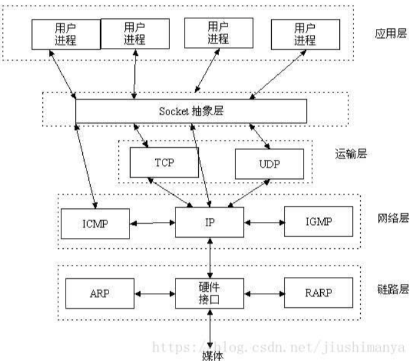
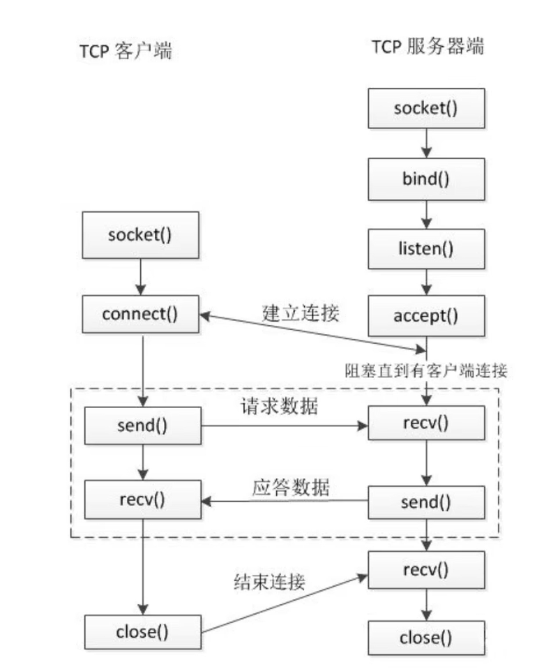
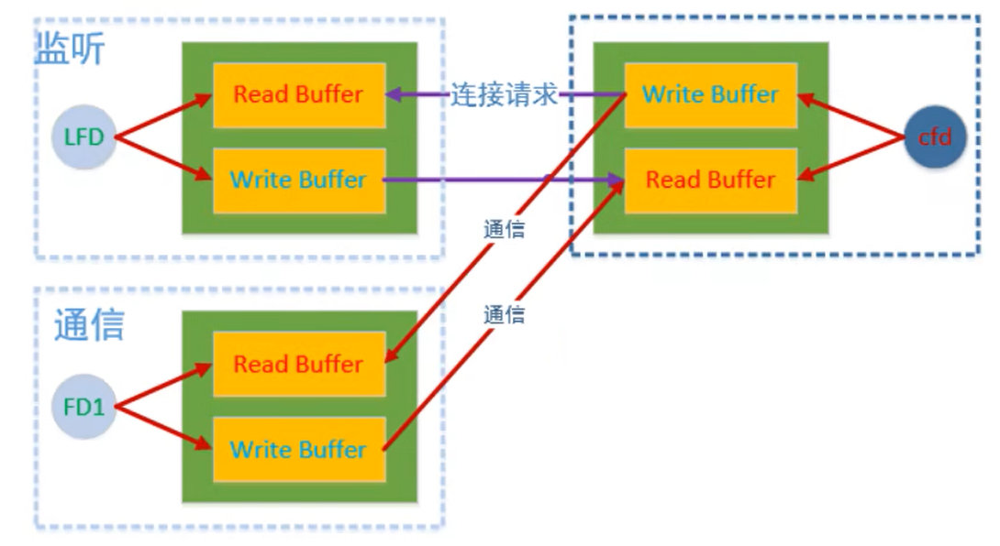

1. `ip`地址确定是哪个计算机,端口号用来确定是哪个进程（该计算机的哪个服务）
2. 网络通信的主体部分是:客户端、服务器.在客户端和服务器通信的时候主要涉及:IP、端口、通信数据
3. `socket`其实就是个代码库或接口层,它介于内核和应用程序之间，提供了一些高度封装过的接口,让我们使用内核网络的传输功能.<span style="color:red;">`socket`就是我们调用内核所提供的服务的一种方法</span>.`socket`可以形象的想做一个应用程序的"插座"
4. 在网络通信中,`socket`具体指的是一种编程接口,用于实现网络通信.<mark>它是一种抽象概念,代表一个端点,能够通过网络与其它应用程序进行通信.这个端点可以是服务端或客户端,在TCP/IP协议中，套接字通常由IP地址和端口号来标识</mark>.在编程中,通过套接字可以创建、配置、连接、发送和接收数据,从而实现网络通信
   
5. 在设计模式中,`Socket`就是一个门面模式,它把复杂的`TCP/IP`协议族隐藏在`Socket`接口后面,对于用户来说,一组简单的接口就是全部,让`Socket`去组织数据,以符合指定的协议
   
6. `uname -a`查看内核/操作系统/CPU
7. `exit(0)`:C++中提前退出程序,不管是局部函数还是什么,只要遇到就会完全退出`main`主程序
8. <mark>`socket`就是为了用户程序能访问内核的一个接口</mark>
# 字节序
1. 目前各种计算机中通常采用的字节存储机制主要有两种:`Big-Endian`(大端)和`Little-Endian`(小端)
2. 大端-网络字节序(网络通信时用的大端),小端-主机字节序
3. 小端:数据的低位字节存储到内存的低地址位,数据的高位字节存储到内存的高地址位.PC机默认是小端;大端则相反.<mark>套接字通信过程中操作的数据都是大端存储的,包括:接收/发送的数据、IP地址、端口</mark>
4. 大小端转换函数
   ```C++
   htons();
   htonl();
   ntohl();
   ntohs();
   ```
# TCP
1. TCP是一个面向连接的(三次握手)、安全的、流式传输协议，这是一个传输层协议
2. TCP连接:三次握手;TCP断开:四次挥手
3. 在网络通信中,"操作是阻塞的"指的是当程序执行一个网络操作(比如`send(),recv()`)时,程序会被阻塞,直到这个操作完成或者出现错误，这意味着,在执行网络操作期间,程序无法执行其它任务,它会一直等待直到网络操作完成
4. `send  recv  accept`的阻塞和非阻塞解释:
   * `send`
     - 阻塞模式:默认情况下,`send`是阻塞的.如果发送缓冲区满了,`send`将会一直等待,直到足够的空间可用为止,即此时一定会发送完全
     - 非阻塞模式:如果发送缓冲区满了,`send`将会立即返回-1并设置一个错误代码(如`EWOULDBLOC`或`EAGAIN`),而不是等待缓冲区有足够的空间.
   * `recv`
     - 阻塞模式:默认情况下,`recv`是阻塞的.如果接收缓冲区为空了,`recv`将会一直等待,直到有数据可用为止,即此时一定会接收到数据
     - 非阻塞模式:如果接收缓冲区为空,`recv`将会立即返回-1并设置一个错误代码(如`EWOULDBLOC`或`EAGAIN`),而不是等待数据到达.<mark>注:返回错误码,不是报错,不是退出程序,如果不处理它,对后序的代码逻辑的执行没有任何影响,只是不处理它的话如果在后序程序中使用了接收数据,此时就有问题了,因为可能根本没有接收到数据</mark>
   * `accept`
     - 阻塞模式:默认情况下,`accept`是阻塞的.如果当前没有客户端连接到服务器,`accept`将会一直等待,直到有客户端到达
     - 非阻塞模式:在非阻塞模式下,如果当前没有客户端连接到服务器,`accept`将会立即返回一个错误代码(如`EWOULDBLOC`或`EAGAIN`),而不是等待连接到达
5. <mark>非阻塞模式下`recv  send`没读取到数据或发送缓冲区满了都会返回-1,如果直接`exit`其实是不合理的.非阻塞在此时会返回-1并设置错误码`errno`,而不是阻塞等待.因此:如果你在设置了非阻塞模式的`recv/send`函数后,直接在返回值为-1时调用`exit()`,程序很可能会在一运行到`recv/send`而没读取到数据时就直接退出整个程序,因此一般此时不用`exit`</mark>
6. <mark>在接收100字节的数据时,如果缓冲区中只有50字节,`recv`会立即返回这50字节的数据,而不会继续阻塞直到接收到全部100字节</mark>
7. 服务器端通信流程:
   ```C++
   1. 创建用于监听的套接字,这个套接字是一个文件描述符(检查有没有新的客户端来连接)
   int fd = socket();
   2. 将得到的监听文件描述符和本地的IP端口进绑定
   bind(int sockfd, const struct sockaddr *addr, socklen_t addrlen);//将sockfd与sockaddr结构体中的addr的IP和端口绑定
   3. 设置监听(成功之后才开始监听,即成功之后用于检查客户端连接的套接字才开始工作,监听的是客户端的连接)
   listen();
   4. 等待并接受客户端的连接请求(握手请求),建立新的连接,会得到一个新的文件描述符(通信的,第一步那个是监听的文件描述符),没有新连接(握手)请求就阻塞
   int fd2 = accept();//要建立多个连接请求,需要多个accept
   5. 通信,读写操作默认是阻塞的
   read();/recv();
   write();/send();
   6. 断开连接,关闭套接字
   close();//服务端调用一次就是挥手两次
   ```
8. 客户端通信流程:
   ```C++
   1. 创建一个通信的套接字,得到监听文件描述符
   int fd1 = socket();
   2. 连接服务器,需要知道服务器绑定的IP和端口(是客户端主动连接)
   connect(int sockfd, const struct sockaddr *addr, socklen_t addrlen);//客户端在调用connect()后会自动随机给客户端程序绑定一个未被占用的端口和此客户端的IP地址,因此在这不需要显式给客户端分配IP和PORT,addr中给定的是服务器的IP和PORT
   3. 通信
   read();/recv();
   write();/send();
   4. 断开连接
   close();
   ```
9.  
   ```C++
   struct sockaddr{
      sa_family_t sa_family;//4字节,地址族协议
      char sa_data[14];//port(2字节)+IP地址(4字节)+填充(8字节)
   }
   ```
10. 在同一台计算机上进行服务端-客户端通信测试时:
   ```s
   1. 
   服务端=127.0.0.1  客户端=本地局域网IP    
   #此时是不能通信的,服务端监听的地址是 127.0.0.1，表示仅接受来自本地的连接。因此，如果客户端尝试使用局域网IP地址连接，连接请求将被拒绝，导致连接失败
   2. 
   服务端=127.0.0.1  客户端=127.0.0.1#可以的
   3.
   服务端=本地局域网IP  客户端=本地局域网IP#可以的
   4.
   服务端=INADDR_ANY    客户端=本地局域网IP/127.0.0.1#都行
   ```
11. 在实际应用中,一般我们在服务端绑定端口的时候可以选择绑定到0.0.0.0(INADDR_ANY),这样我的服务访问方就可以通过我的多个ip地址访问我的服务
12. 与n个客户端通信,那么服务端的通信文件描述符个数=n
13. 在一般情况下,客户端连接服务器时,通常不需要手动指定客户端自己的IP地址和端口号.这是因为在 TCP/IP 协议中,客户端通常会使用动态分配的本地端口号,并且通过服务器的IP地址和端口号来连接服务器.当客户端调用 `connect()` 函数连接服务器时，操作系统会自动分配一个本地端口号，同时客户端需要提供服务器的IP地址和端口号作为连接目标.客户端的IP地址则是由操作系统自动分配的,一般情况下不需要客户端显式指定.客户端的端口号通常在 `connect()` 函数中不需要指定,系统会自动分配一个可用的端口号
14. <mark>每个文件描述符对应的都是一个读缓冲区和写缓冲区</mark>
    
15. 文件描述符的输入、输出缓冲区:
    * 输入缓冲区:输入缓冲区是操作系统内核为每个文件描述符维护的一部分内存空间,用于临时存储从文件描述符中读取的数据.当数据从网络或文件(如:客户端发送的消息数据)中读取到操作系统内核时,会首先存储在输入缓冲区中,等待应用程序调用`read`,将其复制到用户空间的缓冲区中(对端发来的数据先存到输入缓冲区)  需要注意:监听fd的“输入缓冲区”里永远不会有任何字节数.当有客户端连接请求到来,该服务端的监听fd的可读事件只是在API层面用 POLLIN/EPOLLIN标识，实际含义是“可以 accept() 新连接”，而它的输入缓冲区是空的,没有字节数据，因此监听fd的可读事件是和通信fd不一样的
    * 输出缓冲区:它用于临时存储即将发送到另一个文件描述符的数据.当应用程序调用`send`将数据发送到另一个文件描述符时,数据会首先存放在这个输出缓冲区中,然后由操作系统负责实际发送到目标(如网络或文件)(自己待发的数据先存到这里)
16. 套接字也是一种文件描述符
